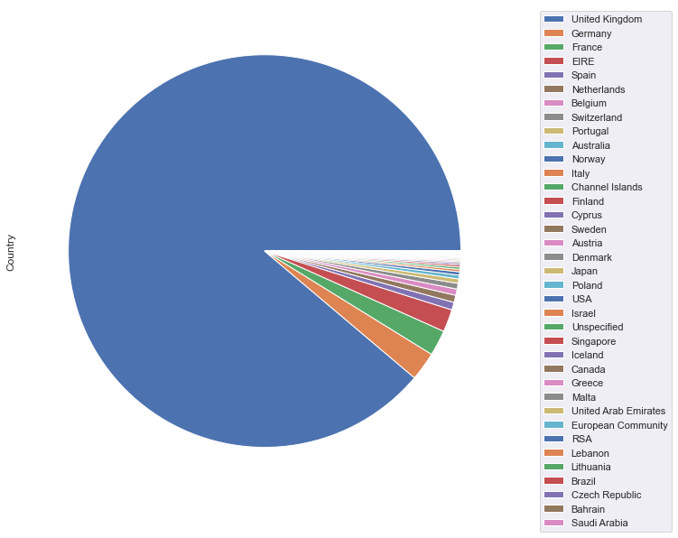
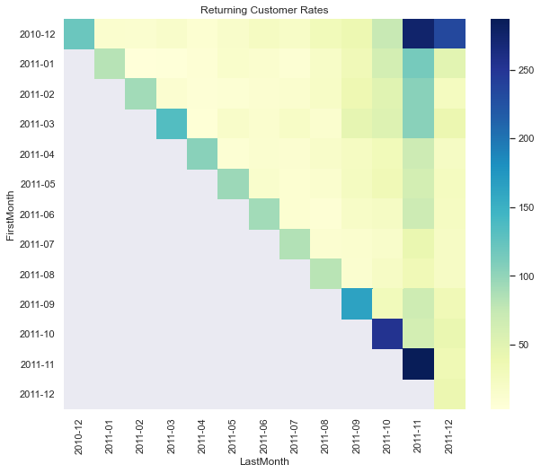

# Customer Segmentation


## Data Set Information [[Link]](https://archive.ics.uci.edu/ml/datasets/Online+Retail#):
This is a transnational data set which contains all the transactions occurring between 01/12/2010 and 09/12/2011 for a UK-based and registered non-store online retail.The company mainly sells unique all-occasion gifts. Many customers of the company are wholesalers.

## Attribute Information:
* __InvoiceNo__: Invoice number. Nominal, a 6-digit integral number uniquely assigned to each transaction. If this code starts with letter 'c', it indicates a cancellation.
* __StockCode__: Product (item) code. Nominal, a 5-digit integral number uniquely assigned to each distinct product.
* __Description__: Product (item) name. Nominal.
* __Quantity__: The quantities of each product (item) per transaction. Numeric.
* __InvoiceDate__: Invoice Date and time. Numeric, the day and time when each transaction was generated.
* __UnitPrice__: Unit price. Numeric, Product price per unit in sterling.
* __CustomerID__: Customer number. Nominal, a 5-digit integral number uniquely assigned to each customer.
* __Country__: Country name. Nominal, the name of the country where each customer resides.

```python
import pandas as pd
import seaborn as sns
import matplotlib.pyplot as plt
import datetime as dt
import numpy as np
from sklearn.preprocessing import StandardScaler
from sklearn.cluster import KMeans
```

#### Load data
___


```python
df = pd.read_excel('../data/Online Retail.xlsx')
```


```python
df.head()
```


<div>
<style scoped>
    .dataframe tbody tr th:only-of-type {
        vertical-align: middle;
    }

    .dataframe tbody tr th {
        vertical-align: top;
    }

    .dataframe thead th {
        text-align: right;
    }
</style>
<table border="1" class="dataframe">
  <thead>
    <tr style="text-align: right;">
      <th></th>
      <th>InvoiceNo</th>
      <th>StockCode</th>
      <th>Description</th>
      <th>Quantity</th>
      <th>InvoiceDate</th>
      <th>UnitPrice</th>
      <th>CustomerID</th>
      <th>Country</th>
    </tr>
  </thead>
  <tbody>
    <tr>
      <th>0</th>
      <td>536365</td>
      <td>85123A</td>
      <td>WHITE HANGING HEART T-LIGHT HOLDER</td>
      <td>6</td>
      <td>2010-12-01 08:26:00</td>
      <td>2.55</td>
      <td>17850.0</td>
      <td>United Kingdom</td>
    </tr>
    <tr>
      <th>1</th>
      <td>536365</td>
      <td>71053</td>
      <td>WHITE METAL LANTERN</td>
      <td>6</td>
      <td>2010-12-01 08:26:00</td>
      <td>3.39</td>
      <td>17850.0</td>
      <td>United Kingdom</td>
    </tr>
    <tr>
      <th>2</th>
      <td>536365</td>
      <td>84406B</td>
      <td>CREAM CUPID HEARTS COAT HANGER</td>
      <td>8</td>
      <td>2010-12-01 08:26:00</td>
      <td>2.75</td>
      <td>17850.0</td>
      <td>United Kingdom</td>
    </tr>
    <tr>
      <th>3</th>
      <td>536365</td>
      <td>84029G</td>
      <td>KNITTED UNION FLAG HOT WATER BOTTLE</td>
      <td>6</td>
      <td>2010-12-01 08:26:00</td>
      <td>3.39</td>
      <td>17850.0</td>
      <td>United Kingdom</td>
    </tr>
    <tr>
      <th>4</th>
      <td>536365</td>
      <td>84029E</td>
      <td>RED WOOLLY HOTTIE WHITE HEART.</td>
      <td>6</td>
      <td>2010-12-01 08:26:00</td>
      <td>3.39</td>
      <td>17850.0</td>
      <td>United Kingdom</td>
    </tr>
  </tbody>
</table>
</div>


```python
df.info()
```

    <class 'pandas.core.frame.DataFrame'>
    RangeIndex: 541909 entries, 0 to 541908
    Data columns (total 8 columns):
     #   Column       Non-Null Count   Dtype         
    ---  ------       --------------   -----         
     0   InvoiceNo    541909 non-null  object        
     1   StockCode    541909 non-null  object        
     2   Description  540455 non-null  object        
     3   Quantity     541909 non-null  int64         
     4   InvoiceDate  541909 non-null  datetime64[ns]
     5   UnitPrice    541909 non-null  float64       
     6   CustomerID   406829 non-null  float64       
     7   Country      541909 non-null  object        
    dtypes: datetime64[ns](1), float64(2), int64(1), object(4)
    memory usage: 33.1+ MB


```python
df.shape
```


    (541909, 8)


#### Check if there is missing data
___


```python
df.isnull().sum()
```


    InvoiceNo           0
    StockCode           0
    Description      1454
    Quantity            0
    InvoiceDate         0
    UnitPrice           0
    CustomerID     135080
    Country             0
    dtype: int64


#### Drop rows with nulls and check again
___


```python
df = df.dropna()
df.isnull().sum()
```


    InvoiceNo      0
    StockCode      0
    Description    0
    Quantity       0
    InvoiceDate    0
    UnitPrice      0
    CustomerID     0
    Country        0
    dtype: int64


#### See if we have duplicates
___


```python
df.duplicated().sum()
```


    5225


#### Drop duplicates and check again
___


```python
df = df.drop_duplicates()
df.duplicated().sum()
```


    0


#### Cast columns to appropriate types
___


```python
df['InvoiceDate'] = pd.to_datetime(df['InvoiceDate'])
```


```python
df['InvoiceNo'] = df['InvoiceNo'].astype(str)
```


```python
df['CustomerID'] = df['CustomerID'].astype(int)
```


```python
sns.set_style('darkgrid')
sns.set(font_scale=1)
```

#### Explore the data
___


```python
_, ax = plt.subplots(figsize=(12, 10))
_ = df['Country'].value_counts().plot.pie(ax=ax,
                                          labels=list(str(' ') * 
                                                      len(df['Country'].unique())))
_ = ax.legend(loc='best', bbox_to_anchor=(1.05, 1), 
              labels=df['Country'].value_counts().index)
```





#### See how many unique column entries exist in ∼ 400,000 rows
___


```python
for column in df.columns:
    print(column, '\t::', len(df[column].value_counts()))
```

    InvoiceNo 	:: 22190
    StockCode 	:: 3684
    Description 	:: 3896
    Quantity 	:: 436
    InvoiceDate 	:: 20460
    UnitPrice 	:: 620
    CustomerID 	:: 4372
    Country 	:: 37


##### *-> 3684 unique products present.*
##### *-> 4372 customer details covered.*
##### *-> 37 countries represented.*


```python
orders = df.groupby(['CustomerID', 'InvoiceNo']).size()
```


```python
orders
```


    CustomerID  InvoiceNo
    12346       541431        1
                C541433       1
    12347       537626       31
                542237       29
                549222       24
                             ..
    18283       579673       50
                580872       50
    18287       554065       29
                570715       38
                573167        3
    Length: 22190, dtype: int64


##### *-> An invoice number starting with 'C' means cancellation.*

#### Check how many orders are cancelelled ones in the dataset
___


```python
cancelled_orders = (
    orders[orders.index.get_level_values('InvoiceNo').str.startswith('C')])
len(cancelled_orders)
```


    3654


```python
(len(cancelled_orders) / len(orders)) * 100
```


    16.466876971608833


##### *-> Some 16% of orders are cancelled ones.*
##### *-> Let's get rid of these too. Should we ust delete all cancelled orders?*
##### *-> For the first customer in the above `orders` series we see something interesting.*
##### *-> Looks like a cancelled order has a counterpart (541431 is the order and C541433 is its cancellation)*


```python
df[df.CustomerID == 12346]
```


<div>
<style scoped>
    .dataframe tbody tr th:only-of-type {
        vertical-align: middle;
    }

    .dataframe tbody tr th {
        vertical-align: top;
    }

    .dataframe thead th {
        text-align: right;
    }
</style>
<table border="1" class="dataframe">
  <thead>
    <tr style="text-align: right;">
      <th></th>
      <th>InvoiceNo</th>
      <th>StockCode</th>
      <th>Description</th>
      <th>Quantity</th>
      <th>InvoiceDate</th>
      <th>UnitPrice</th>
      <th>CustomerID</th>
      <th>Country</th>
    </tr>
  </thead>
  <tbody>
    <tr>
      <th>61619</th>
      <td>541431</td>
      <td>23166</td>
      <td>MEDIUM CERAMIC TOP STORAGE JAR</td>
      <td>74215</td>
      <td>2011-01-18 10:01:00</td>
      <td>1.04</td>
      <td>12346</td>
      <td>United Kingdom</td>
    </tr>
    <tr>
      <th>61624</th>
      <td>C541433</td>
      <td>23166</td>
      <td>MEDIUM CERAMIC TOP STORAGE JAR</td>
      <td>-74215</td>
      <td>2011-01-18 10:17:00</td>
      <td>1.04</td>
      <td>12346</td>
      <td>United Kingdom</td>
    </tr>
  </tbody>
</table>
</div>


##### *-> Everything is the same except for __InvoiceNo__, __InvoiceDate__ and __Quantity__ (which is negative of original order quantity)*


```python
cancelled_orders_df = df[df.InvoiceNo.isin(
    cancelled_orders.index.get_level_values('InvoiceNo'))]
```


```python
cancelled_orders_counterparts = []
for _, row in cancelled_orders_df.iterrows():
    cancelled_orders_counterparts.append((row.StockCode, row.Description, 
                                          -row.Quantity, row.UnitPrice, 
                                          row.CustomerID, row.Country, row.InvoiceDate))
```


```python
for (stock_code, description, quantity, unit_price, 
     customer_id, country, invoice_date) in cancelled_orders_counterparts:
    entry = df[(df.StockCode == stock_code) & (df.Description == description) & 
               (df.Quantity == quantity) & (df.UnitPrice == unit_price) & 
               (df.CustomerID == customer_id) & (df.Country == country)]
    if len(entry) > 1:
        print(entry)
        break
```

           InvoiceNo StockCode                Description  Quantity  \
    119473    546543     22355  CHARLOTTE BAG SUKI DESIGN         2   
    140961    548492     22355  CHARLOTTE BAG SUKI DESIGN         2   
    146715    549014     22355  CHARLOTTE BAG SUKI DESIGN         2   
    159733    550359     22355  CHARLOTTE BAG SUKI DESIGN         2   
    206562    554942     22355  CHARLOTTE BAG SUKI DESIGN         2   
    214010    555562     22355  CHARLOTTE BAG SUKI DESIGN         2   
    303345    563538     22355  CHARLOTTE BAG SUKI DESIGN         2   
    306551    563771     22355  CHARLOTTE BAG SUKI DESIGN         2   
    309824    564141     22355  CHARLOTTE BAG SUKI DESIGN         2   
    393284    570818     22355  CHARLOTTE BAG SUKI DESIGN         2   
    
                   InvoiceDate  UnitPrice  CustomerID         Country  
    119473 2011-03-14 15:40:00       0.85       17841  United Kingdom  
    140961 2011-03-31 13:14:00       0.85       17841  United Kingdom  
    146715 2011-04-05 15:00:00       0.85       17841  United Kingdom  
    159733 2011-04-18 10:41:00       0.85       17841  United Kingdom  
    206562 2011-05-27 14:01:00       0.85       17841  United Kingdom  
    214010 2011-06-05 14:45:00       0.85       17841  United Kingdom  
    303345 2011-08-17 11:48:00       0.85       17841  United Kingdom  
    306551 2011-08-19 11:17:00       0.85       17841  United Kingdom  
    309824 2011-08-23 11:47:00       0.85       17841  United Kingdom  
    393284 2011-10-12 12:47:00       0.85       17841  United Kingdom  


##### *-> More than one entry exists for the same combination. It makes sense since a customer can place similar kind of order over and over again.*

#### Check when the order was cancelled
___


```python
cancelled_orders_df[(cancelled_orders_df.CustomerID == 17841) & 
                    (cancelled_orders_df.StockCode == 22355)]
```


<div>
<style scoped>
    .dataframe tbody tr th:only-of-type {
        vertical-align: middle;
    }

    .dataframe tbody tr th {
        vertical-align: top;
    }

    .dataframe thead th {
        text-align: right;
    }
</style>
<table border="1" class="dataframe">
  <thead>
    <tr style="text-align: right;">
      <th></th>
      <th>InvoiceNo</th>
      <th>StockCode</th>
      <th>Description</th>
      <th>Quantity</th>
      <th>InvoiceDate</th>
      <th>UnitPrice</th>
      <th>CustomerID</th>
      <th>Country</th>
    </tr>
  </thead>
  <tbody>
    <tr>
      <th>1442</th>
      <td>C536543</td>
      <td>22355</td>
      <td>CHARLOTTE BAG SUKI DESIGN</td>
      <td>-2</td>
      <td>2010-12-01 14:30:00</td>
      <td>0.85</td>
      <td>17841</td>
      <td>United Kingdom</td>
    </tr>
  </tbody>
</table>
</div>


##### *-> It seems this cancellation is for an older order that's not a part of this dataset.*
##### *-> Anyways, given that we can have multiple entries, let's delete the first entry after cancellation __InvoiceDate__ since that's the correct counterpart of cancelled transaction.*


```python
counterpart_indices_to_drop = []
for (stock_code, description, quantity, unit_price, 
     customer_id, country, invoice_date) in cancelled_orders_counterparts:
    entry = df[(df.StockCode == stock_code) & (df.Description == description) & 
               (df.Quantity == quantity) & (df.UnitPrice == unit_price) & 
               (df.CustomerID == customer_id) & (df.Country == country) & 
               (df.InvoiceDate < invoice_date)]
    if len(entry) > 0:
        counterpart_indices_to_drop.append(entry.iloc[0].name)
```


```python
len(counterpart_indices_to_drop)
```


    2771


#### Drop the cancelled orders along with their above found counterparts
___


```python
df.drop(counterpart_indices_to_drop, axis=0, inplace=True)
```


```python
df = df.merge(cancelled_orders_df, how='left', indicator=True)
df = df[df['_merge'] == 'left_only']
df = df.drop(columns='_merge')
```

#### See if we got rid of all cancelled orders
___


```python
df.InvoiceNo.str.startswith('C').unique()
```


    array([False])


##### *-> The dataset is cleaner now. Noice!*

#### Analyze how much have the customers spent
___


```python
grouping = df.groupby(['CustomerID'])
```


```python
spend_data = grouping.apply(lambda x: (x.UnitPrice * x.Quantity).sum())
```


```python
bins = list(range(int(spend_data.min()), int(spend_data.max())+10000, 10000))
spend_buckets = pd.cut(spend_data, bins).value_counts()
spend_buckets
```


    (0, 10000]          4227
    (10000, 20000]        60
    (20000, 30000]        12
    (30000, 40000]         8
    (50000, 60000]         7
    (60000, 70000]         4
    (40000, 50000]         2
    (120000, 130000]       1
    (80000, 90000]         1
    (110000, 120000]       1
    (270000, 280000]       1
    (130000, 140000]       1
    (250000, 260000]       1
    (180000, 190000]       1
    (70000, 80000]         0
    (240000, 250000]       0
    (230000, 240000]       0
    (220000, 230000]       0
    (210000, 220000]       0
    (200000, 210000]       0
    (160000, 170000]       0
    (150000, 160000]       0
    (90000, 100000]        0
    (100000, 110000]       0
    (170000, 180000]       0
    (260000, 270000]       0
    (140000, 150000]       0
    (190000, 200000]       0
    dtype: int64


```python
_ = spend_buckets.plot.bar(figsize=(11.7, 8), rot=90,
                           xlabel ="Spend Range", ylabel='Count')
```


##### *-> About 98% of customers in the dataset have spent under 10,000 in total.*

#### Check the spread amongst these 98% customers
___


```python
spend_under_10k = spend_data[spend_data <= 10000]
```


```python
bins = list(range(int(spend_under_10k.min()), int(spend_under_10k.max())+500, 500))
spend_under_10k_buckets = pd.cut(spend_under_10k, bins).value_counts()
spend_under_10k_buckets
```


    (0, 500]         1773
    (500, 1000]       905
    (1000, 1500]      475
    (1500, 2000]      291
    (2000, 2500]      193
    (2500, 3000]      145
    (3000, 3500]      100
    (3500, 4000]       82
    (4000, 4500]       54
    (4500, 5000]       41
    (5000, 5500]       34
    (5500, 6000]       31
    (6500, 7000]       23
    (6000, 6500]       21
    (7000, 7500]       15
    (7500, 8000]       12
    (8000, 8500]       10
    (8500, 9000]        9
    (9500, 10000]       8
    (9000, 9500]        5
    dtype: int64


```python
_ = spend_under_10k_buckets.plot.bar(figsize=(11.7, 8), rot=90,
                                     colormap="Set3",
                                     xlabel ="Spend Range", ylabel='Count')
```


##### *-> More number of customers spend less and vice-versa.*

#### Analyze the difference between first and last invoice dates of customers to get an idea about returning customers
___


```python
returning_customers = df.loc[:, ['CustomerID', 'InvoiceDate']]
```


```python
returning_customers['Month'] = returning_customers['InvoiceDate'].apply(
    lambda x: dt.datetime(x.year, x.month, 1))
```


```python
grouping = returning_customers.groupby('CustomerID')['Month']
```


```python
returning_customers['FirstMonth'] = grouping.transform('min')
returning_customers['LastMonth'] = grouping.transform('max')
```


```python
returning_customers = returning_customers.drop_duplicates(
    subset=['CustomerID', 'FirstMonth', 'LastMonth'])
```


```python
returning_customers = returning_customers.groupby(['FirstMonth', 
                                                   'LastMonth']).size().to_frame()
```


```python
returning_customers.columns = ['Count']
```


```python
returning_customers = returning_customers.reset_index()
```


```python
returning_customers['FirstMonth'] = returning_customers['FirstMonth'].astype(str)
returning_customers['LastMonth'] = returning_customers['LastMonth'].astype(str)
```


```python
returning_customers['FirstMonth'] = (returning_customers['FirstMonth']
                                     .str.slice(0, -3))
returning_customers['LastMonth'] = (returning_customers['LastMonth']
                                    .str.slice(0, -3))
```


```python
_ = plt.figure(figsize=(10, 8))
_ = plt.title('Returning Customer Rates')
_ = sns.heatmap(returning_customers.pivot(index='FirstMonth',
                                          columns='LastMonth',
                                          values='Count'), cmap="YlGnBu")
```





##### *-> Looks like there are many returning customers. We can see that above 200 had their first and last order placed in the first and last months of the dataset.*

#### Compute some meaningful values for each customer: 
##### &ensp; 1. OrderCount = How many times the customer placed an order?
##### &ensp; 2. Spend = How much money did the customer spend? Same as the *Spend Range* we explored above.
___


```python
df['Spend'] = df['Quantity'] * df['UnitPrice']
```


```python
customer_info = df.groupby('CustomerID').agg({
    'Spend': 'sum',
    'InvoiceNo': 'count'
})
```


```python
customer_info.rename(columns={'InvoiceNo': 'OrderCount'}, inplace=True)
```


```python
customer_info
```


<div>
<style scoped>
    .dataframe tbody tr th:only-of-type {
        vertical-align: middle;
    }

    .dataframe tbody tr th {
        vertical-align: top;
    }

    .dataframe thead th {
        text-align: right;
    }
</style>
<table border="1" class="dataframe">
  <thead>
    <tr style="text-align: right;">
      <th></th>
      <th>Spend</th>
      <th>OrderCount</th>
    </tr>
    <tr>
      <th>CustomerID</th>
      <th></th>
      <th></th>
    </tr>
  </thead>
  <tbody>
    <tr>
      <th>12347</th>
      <td>4310.00</td>
      <td>182</td>
    </tr>
    <tr>
      <th>12348</th>
      <td>1797.24</td>
      <td>31</td>
    </tr>
    <tr>
      <th>12349</th>
      <td>1757.55</td>
      <td>73</td>
    </tr>
    <tr>
      <th>12350</th>
      <td>334.40</td>
      <td>17</td>
    </tr>
    <tr>
      <th>12352</th>
      <td>2385.71</td>
      <td>78</td>
    </tr>
    <tr>
      <th>...</th>
      <td>...</td>
      <td>...</td>
    </tr>
    <tr>
      <th>18280</th>
      <td>180.60</td>
      <td>10</td>
    </tr>
    <tr>
      <th>18281</th>
      <td>80.82</td>
      <td>7</td>
    </tr>
    <tr>
      <th>18282</th>
      <td>178.05</td>
      <td>12</td>
    </tr>
    <tr>
      <th>18283</th>
      <td>2045.53</td>
      <td>721</td>
    </tr>
    <tr>
      <th>18287</th>
      <td>1837.28</td>
      <td>70</td>
    </tr>
  </tbody>
</table>
<p>4328 rows × 2 columns</p>
</div>


#### Use k-Means, the unsupervised learning algorithm, to create clusters of customers
___


```python
_ = sns.histplot(customer_info['OrderCount'], kde=True)
```


```python
_ = sns.histplot(customer_info['Spend'], kde=True)
```


##### *-> The data is really skewed so let's do log transformation*


```python
customer_info = customer_info.loc[(customer_info > 0).all(axis=1)]
```


```python
customer_log = np.log(customer_info)
```


```python
_ = sns.histplot(customer_log['OrderCount'], kde=True)
```


```python
_ = sns.histplot(customer_log['Spend'], kde=True)
```


##### *-> The skewness has been taken care of now as can be seen in the above two plots*


```python
customer_log.describe()
```


<div>
<style scoped>
    .dataframe tbody tr th:only-of-type {
        vertical-align: middle;
    }

    .dataframe tbody tr th {
        vertical-align: top;
    }

    .dataframe thead th {
        text-align: right;
    }
</style>
<table border="1" class="dataframe">
  <thead>
    <tr style="text-align: right;">
      <th></th>
      <th>Spend</th>
      <th>OrderCount</th>
    </tr>
  </thead>
  <tbody>
    <tr>
      <th>count</th>
      <td>4327.000000</td>
      <td>4327.000000</td>
    </tr>
    <tr>
      <th>mean</th>
      <td>6.572267</td>
      <td>3.666815</td>
    </tr>
    <tr>
      <th>std</th>
      <td>1.258625</td>
      <td>1.321747</td>
    </tr>
    <tr>
      <th>min</th>
      <td>1.064711</td>
      <td>0.000000</td>
    </tr>
    <tr>
      <th>25%</th>
      <td>5.717373</td>
      <td>2.833213</td>
    </tr>
    <tr>
      <th>50%</th>
      <td>6.491345</td>
      <td>3.713572</td>
    </tr>
    <tr>
      <th>75%</th>
      <td>7.403759</td>
      <td>4.584967</td>
    </tr>
    <tr>
      <th>max</th>
      <td>12.541995</td>
      <td>8.934587</td>
    </tr>
  </tbody>
</table>
</div>


```python
scaler = StandardScaler()
scaler.fit(customer_log)
normalized_data = scaler.transform(customer_log)
```

##### *-> Normalized the data because k-Means expects variables with same average values and variance*


```python
sse = {}
for k in range(1, 11):
    kmeans = KMeans(n_clusters=k, random_state=1)
    kmeans.fit(normalized_data)
    sse[k] = kmeans.inertia_ 
```


```python
_ = plt.title('Elbow Curve')
_ = plt.xlabel('k')
_ = plt.ylabel('SSE')
_ = sns.pointplot(x=list(sse.keys()), y=list(sse.values()))
```


##### *-> We used the Elbow Method above to pick the most suitable k values. Let's pick k=3*


```python
kmeans = KMeans(n_clusters=3, random_state=1)
kmeans.fit(normalized_data)
cluster_labels = kmeans.labels_
customer_info_k3 = customer_info.assign(Cluster=cluster_labels)
```


```python
customer_info_k3.groupby('Cluster').agg({
    'OrderCount': 'mean',
    'Spend': 'mean'
}).round(0)
```


<div>
<style scoped>
    .dataframe tbody tr th:only-of-type {
        vertical-align: middle;
    }

    .dataframe tbody tr th {
        vertical-align: top;
    }

    .dataframe thead th {
        text-align: right;
    }
</style>
<table border="1" class="dataframe">
  <thead>
    <tr style="text-align: right;">
      <th></th>
      <th>OrderCount</th>
      <th>Spend</th>
    </tr>
    <tr>
      <th>Cluster</th>
      <th></th>
      <th></th>
    </tr>
  </thead>
  <tbody>
    <tr>
      <th>0</th>
      <td>11.0</td>
      <td>242.0</td>
    </tr>
    <tr>
      <th>1</th>
      <td>234.0</td>
      <td>5564.0</td>
    </tr>
    <tr>
      <th>2</th>
      <td>48.0</td>
      <td>742.0</td>
    </tr>
  </tbody>
</table>
</div>


##### *-> Cluster **0** has customers with least average orders and spend whereas cluster **1** has customers with highest average orders and spend.*


```python
_ = plt.subplots(figsize=(12, 10))

_ = sns.scatterplot(x='Spend', y='OrderCount',
                    hue='Cluster', palette='Set2', 
                    data=customer_info_k3)
```


##### *-> Looks like we have some really platinum category customers so the scatter looks like above*
##### *-> Indeed, when we were exploring the data we saw the same situation where some 2% customers had comparatively very high spend value*


```python
_ = plt.subplots(figsize=(12, 10))

_ = sns.scatterplot(x='Spend', y='OrderCount',
                    hue='Cluster', palette='Set2',
                    data=customer_info_k3[customer_info_k3.Spend <= 10000])
```


##### *-> The above scatter plot with customers having spend below 10k gives a better picture about how clusters have been created.*
